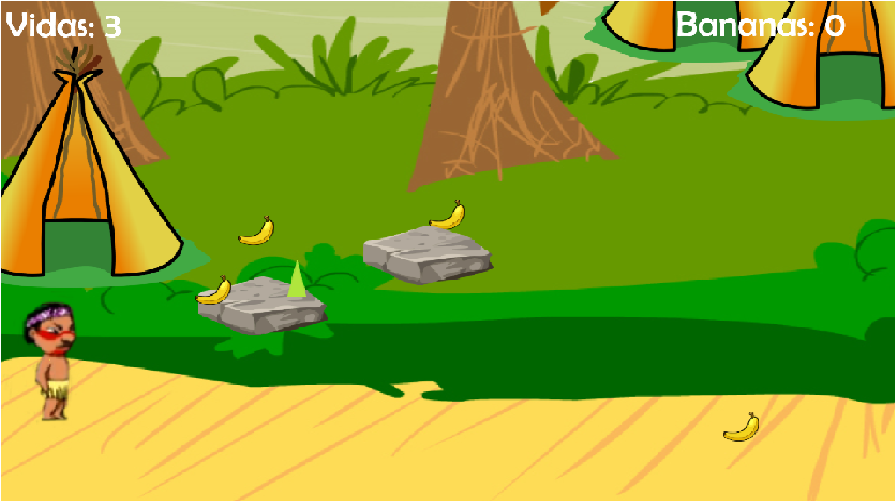
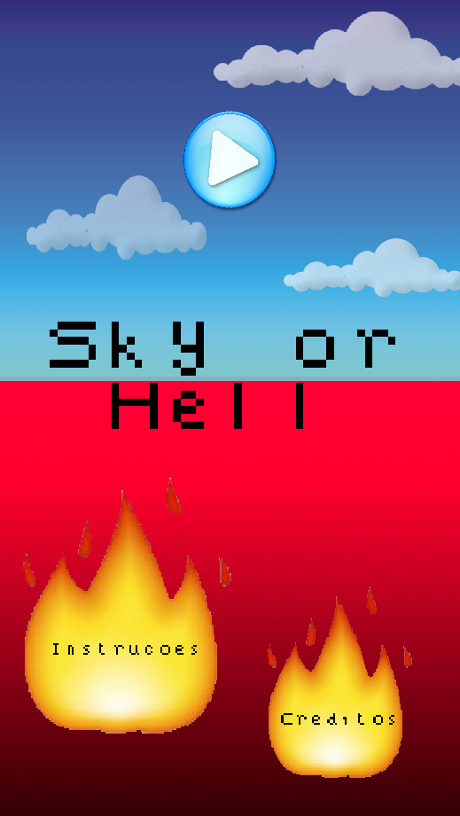
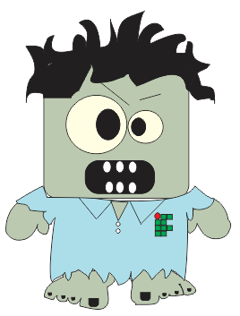
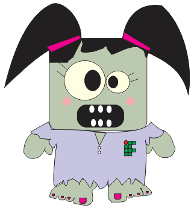
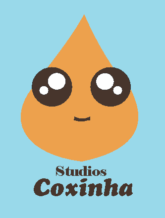

# MARIA LUIZA TÔRRES 
* * *

Olá, sou Malu! Tenho 18 anos, moro em Ceará-Mirim/RN, estou cursando o 3º ano de Programação de Jogos Digitais no IFRN, e este site é para expor o meu Portfólio que mostra a aplicação prática dos conhecimentos teóricos com criatividade, desenvolvido para a disciplina de Motores II com orientação do prof. Marcelo Barros.

# Portfólio
* * *

## Games
* * *

* Cacique é um jogo de plataforma em 3ª pessoa, onde o objetivo é ajudar o cacique a conseguir alimentos para a sua tribo. 

* Sky Or Hell foi produzido com o intuito de mostrar aos jogadores como chegar ao céu praticando o que agrada a Deus.

[Time IF](https://ortegagamer.github.io/GAMES/TimeIF/)

* Time IF é jogado em 1ª pessoa e tem o objetivo de fugir de um campus abandonado do IFRN.

[Texto que vai aparecer](link)

## Artes
* * *

## Animações
* * *

## Projetos
* * *

[Projeto Tower Defense](https://docs.google.com/document/d/1lrXzKqerY_mEJzq13pbQ5NXuLQaIVNnSVZRXJFqMkpw/edit?usp=sharing)

[Projeto TPM](https://docs.google.com/document/d/1xqlDq506KE5JzwqrHWI9lRNqczwdvhuR1n3EqJ9Uk94/edit?usp=sharing)

[Projeto TPM - Web site](https://tpmundo.github.io/home)

* * *

** negrito  
_ itálico  
~~ riscado  
3* separados por espaço - linha horizontal  
#s uma ou mais hashtsges criam capítulos ou subcapítulos
*s asterico cria lista não ordenada
nºs número seguido de pontuação cria lista ordenada

* * *
